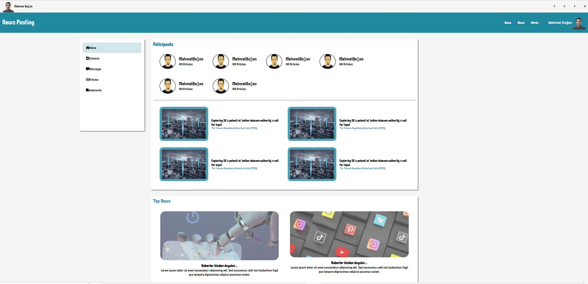

# News Posting

This is a simple news posting web page.

## Table of Contents

- [Description](#description)
- [Technologies Used](#technologies-used)
- [Screenshots](#screenshots)
- [Live Demo](#live-demo)
- [How to Use](#how-to-use)
- [Contributing](#contributing)
- [License](#license)

## Description

The News Posting web page is designed to display news articles and user information.

## Technologies Used

- HTML5
- CSS3
- Font Awesome
- Google Fonts

## Screenshots

## Live Demo

[Live Demo Link](https://your-live-demo-link.com)

## How to Use

1. Clone the repository.
2. Open the `index.html` file in your browser.

## Contributing

Contributions are welcome! Feel free to open a pull request or submit an issue.

## License

This project is licensed under the [MIT License](LICENSE).
